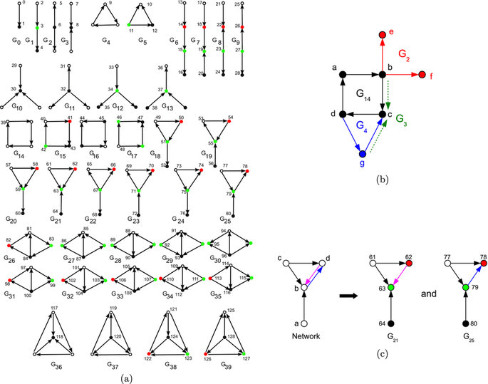

# Full Stack Graph Machine Learning: Theory, Practice, Tools and Techniques v1.1.1

This is a course from Graphlet AI on full-stack graph machine learning taught by Russell Jurney.

<center></center>

## Environment Setup

This class uses a Docker image [rjurney/graphml-class](https://hub.docker.com/repository/docker/rjurney/graphml-class/general). To bring it up as the `jupyter` service along with `neo4j`, run:

```bash
# Pull the Docker images BEFORE class starts, or it can take a while on a shared connection
docker compose pull

# Run a Jupyter Notebook container in the background with all requirements.txt installed
docker compose up -d

# Tail the Jupyter logs to see the JupyterLab url to connect in your browser
docker logs jupyter -f --tail 100
```

To shut down docker, be in this folder and type:

```bash
docker compose down
```

### `docker compose` vs `docker-compose`

You say potato, I say patato... the docker compose command changed in recent versions :)

NOTE: older versions of docker may use the command `docker-compose` rather than the two word command `docker compose`.

## VSCode Setup

To edit code in VSCode you may want a local Anaconda Python environment with the class's PyPi libraries installed.
This will enable VSCode to parse the code, understand APIs and highlight errors.

Note: if you do not use Anaconda, consider using it :) You can use a Python 3 [venv](https://docs.python.org/3/library/venv.html) in the same way as `conda`.

### Class Anaconda Environment

Create a new Anaconda environment:

```bash
conda create -n graphml python=3.10.11 -y
```

Activate the environment:

```bash
conda activate graphml
```

Install the project's libraries:

```bash
poetry install
```

### VSCode Interpretter

You can use a [Python environment](https://code.visualstudio.com/docs/python/environments) in VSCode by typing:

```
SHIFT-CMD-P
```

to bring up a command search window. Now type `Python` or `Interpreter` or if you see it, select `Python: Select Interpreter`. Now choose the path to your conda environment. It will include the name of the environment, such as:

```bash
Python 3.10.11 ('graphml') /opt/anaconda3/envs/graphml/bin/python
```

Note: the Python version is set to `3.10.11` because Jupyter Stacks have not been updated more recently.

## Network Motifs

This course now covers network motifs in pyspark / [GraphFrames](https://graphframes.github.io/graphframes/docs/_site/index.html). It supports directed motifs, not undirected. All the 4-node motifs are outlined below. Note that GraphFrames can also filter the paths returned by its `f.find()` method using any Spark `DataFrame` filter - enabling temporal and complex property graph motifs.

<center></center>
